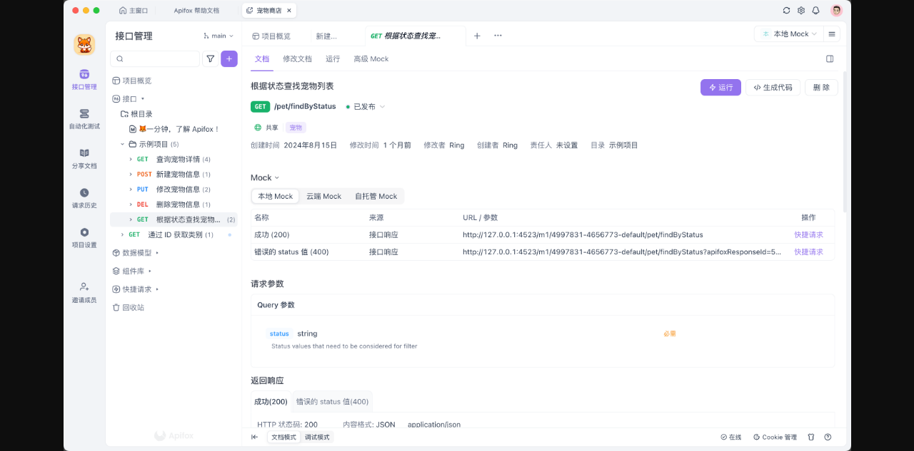
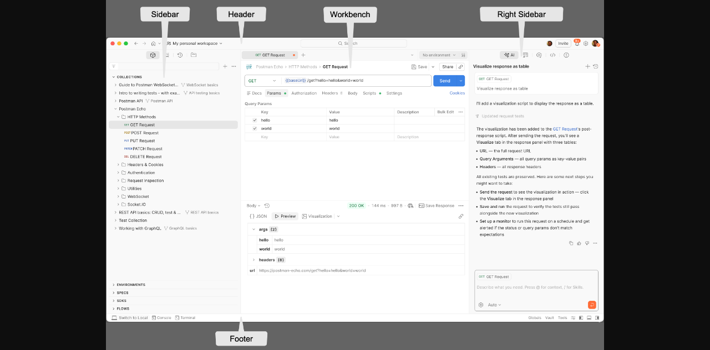
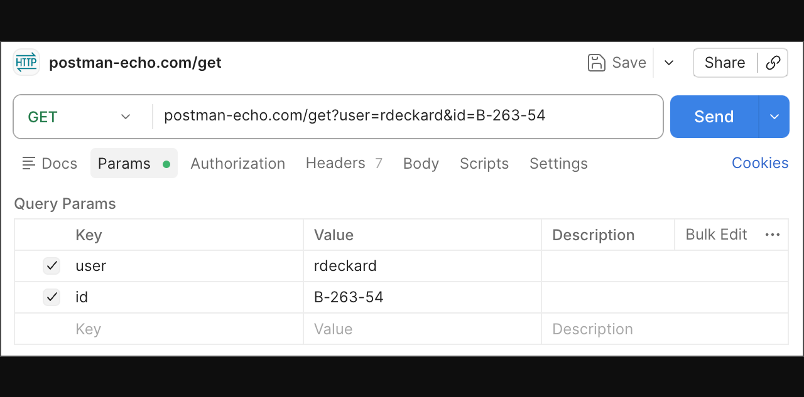

# Apifox / Postman UI 观察与 MoleAPI 设计约束

证据为 agent-browser 浏览的官方文档和文档中公开的工作台截图；没有登录后现场操作。Apifox 页面布局截图文件名带 2024-09-14，不能据它断言 2026 年最新每个控件的位置；Postman 文档明确是 Latest(v12)，工作台官方截图属于 v12。

## Apifox

来源：https://docs.apifox.com/page-layout。

- 最左侧模块导航：接口管理、自动化测试、分享文档、请求历史、项目设置、邀请成员。
- 模块内部目录树：分支/版本、搜索过滤、新建、项目概览、接口、数据模型、组件库、快捷请求、回收站。
- 接口标签内区分文档、修改文档、运行与高级 Mock；规范与真实请求不是同一个编辑表单。
- 文档视图展示方法/路径、发布状态、分享、标签、作者/负责人、Mock 地址、参数与返回响应。
- 环境选择器靠近工作区右上角，底部有在线状态、请求代理、Cookie 和回收站。
- 临时浏览标签与固定编辑标签不同；修改后不应被另一次浏览覆盖。

## Postman v12

来源：https://learning.postman.com/docs/getting-started/basics/navigating-postman/。

- 顶部包括工作区、全局搜索、同步状态、邀请、通知与设置。
- 左侧可切换 Items、Services、History、Local Files；资源包括 Collections、Environments、Documents、Specs、SDKs、Datasets、Flows，支持自定义显示。
- 工作区由请求标签、环境/变量入口、请求配置与响应区域构成；右侧面板放 AI、讨论、代码等上下文工具。
- 底部包括本地/云端视图、Console、Terminal、Globals、Vault、Tools；Native Git 与托管同步是明确不同的工作方式。

HTTP 请求编辑器中，URL/方法/发送位于一行，后面是 Docs、Params、Authorization、Headers、Body、Scripts、Settings。键值表保留启用勾选、名称、值、描述与 Bulk Edit。响应保持静止阅读区域，状态、耗时、体积和保存示例靠近响应内容。

## MoleAPI 从骨架到完整工作台的调整

| Before | After | Why |
| --- | --- | --- |
| 只规划集合与请求侧栏 | 工作台模块导航 + 当前模块资源树；规范、模型、测试、文档、历史、环境、流程有明确位置 | 覆盖完整资源种类，避免把全部功能塞进请求表单 |
| 单一 WorkspaceData JSON 存所有内容 | 独立规范源、资源 ID、集合、调试用例、运行记录、事件/帧与本地覆盖值 | 规范编辑、流式调试、版本与同步需要不同生命周期 |
| Body/Auth 只覆盖最基本选项 | 使用协议类型和能力定义选择成熟编辑器/组件与对应配置 | 不把 gRPC/MQTT/MCP 当成普通 HTTP |
| 所有环境值统一同步 | 共享值、本地覆盖、Vault secret 引用分别展示和保存 | 用户需要知道密钥会不会离开本机 |
| 顺序集合运行代替完整测试 | 场景树/测试套件与独立 Flow 工作区，报告和调度有独立入口 | 两者的编排、复用和运行模型不同 |
| 只做一个简化界面后补功能 | 先据完整矩阵建立导航与模块接口，再逐个实现 | 避免补高级功能时推翻既有布局 |
| 原始 transition 不统一 | 指定 --ease-out 与 160ms 按压、200ms 弹窗、150ms 退出；快捷键操作即时 | ui-ux-pro-max/emil-design-eng/animate 要求明确的动效目的与频率 |

组件方案保持 React + TypeScript + Radix UI + TanStack Query + CodeMirror + Lucide。流程画布评估 React Flow，复杂表格评估 TanStack Table，拖拽评估 dnd-kit；这些是候选组件，未安装/验证的能力不能描述为已实现。

Logo 使用用户指定的透明 PNG，统一用于应用图标和发行包。视觉系统沿用本地字体、语义色阶、Light/Dark/System、可见焦点、粗指针 44px 点击区域与 reduced-motion；不会照抄竞品的品牌色或 Logo。高频标签切换、选择和键盘命令不加过渡，响应内容不为了装饰而移动。
